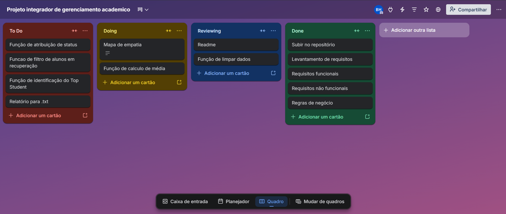
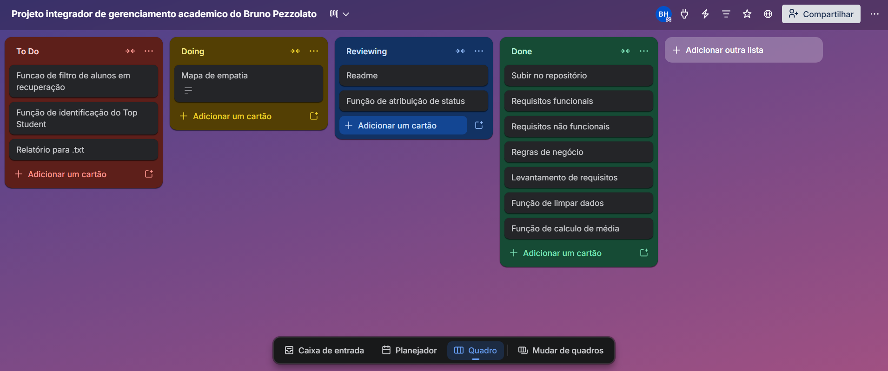
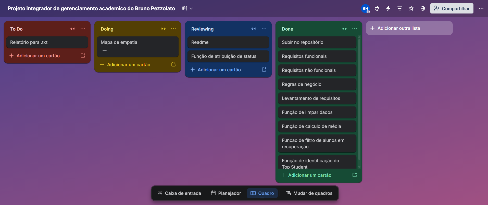

# Projeto Integrador

## Descrição
Projeto de automação de acompanhamento academico SENAI.

## Requisitos do sistema gerenciador de desempenho acadêmico
### Requisitos Funcionais (RF):
- Lista de tuplas formatada com o nome do aluno e lista contendo suas notas com número de notas variável exemplo: [("Nome", [notas])];
- Validação de formato e integridade das notas dos alunos;
- O sistema deve calcular a média das notas de cada aluno;
- Identificar status do aluno conforme o cálculo de sua média;
- Filtrar os alunos que estão com status de recuperação;
- Filtrar o aluno com a maior média de todas (Top Student); 
- Destaque dos estudantes de recuperação e com melhores médias;
- Geração de arquivo .txt contendo informações sobre o processamento de dados entregando um relatório completo e automático.

### Requisitos não funcionais (RNF):
- Automação de processos manuais;
- Desempenho rápido e preciso;
- Modularização do código separando a execução principal e o processamento de dados;
- Tratamento de dados;
- Tratamento de erros;
- Confiabilidade no processamento sem perda de dados;
- Precisão no cálculo da média.

### Regras de negócio:
- O programa deve calcular a média de acordo com as notas do aluno;
- O aluno que obter média menor do que 7.0 é colocado status de “Recuperação”;
- Destacar o aluno com a maior média colocando o status de “Top Student”;
- A quantidade de nota dos alunos pode variar de um para outro;
- O programa deve ignorar o aluno com notas inválidas e retornar o nome para revisão das notas.

## Link do KanBan (Trello)
[Trello](https://trello.com/b/lCj9IxHq)

## Link do mapa de empatia (Miro)
[Trello](https://miro.com/app/board/uXjVGww-9fM=/?share_link_id=696589079850)